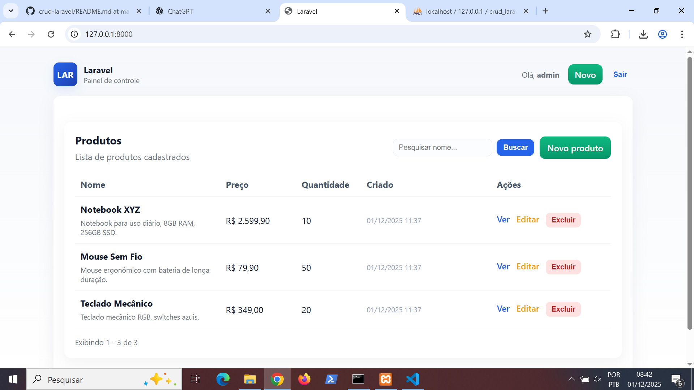
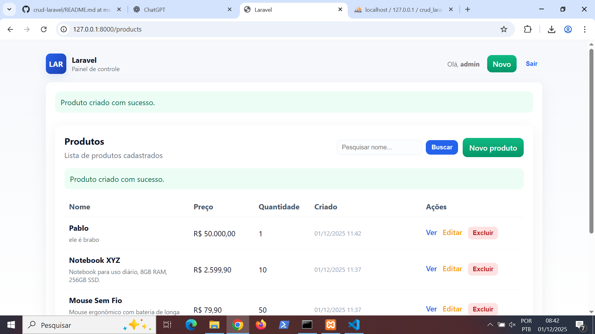

## Prints (ordem de ações)

- **Banco:**

	

- **Login:**

	

- **Produtos cadastrados (tela inicial):**

	

- **Adicionando produto:**

	

- **Produto adicionado:**

	

- **Alterando o produto (editando):**

	

- **Produto alterado:**

	

- **Pesquisando:**

	

- **Excluindo:**

	

## Observações

- As imagens estão na pasta `prints/` no repositório; caso alguma não apareça, verifique nomes com espaços e sensibilidade a maiúsculas.
